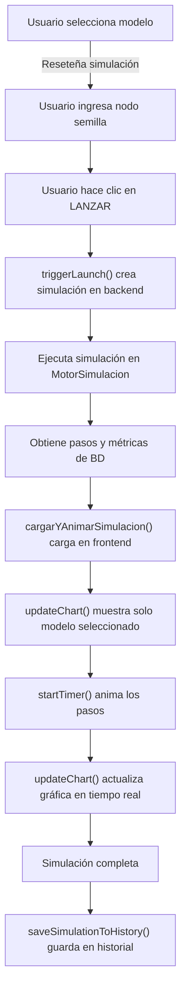

# Correcciones Realizadas - ViralSim

## Problema Original
El frontend mostraba los 3 modelos de propagación (Viral, Cascada, Threshold) a la vez, en lugar de permitir ejecutar solo un modelo seleccionado.

## Solución Implementada

### 1. **Frontend: `js/app.js`**

#### Cambio 1: Nueva función `triggerLaunch()`
- **Antes**: Ejecutaba simulación local en el frontend con los 3 modelos
- **Después**: 
  - Mapea el modelo seleccionado a ID numérico (viral=1, cascada=2, threshold=3)
  - Crea simulación en el backend con `APIService.crearSimulacion(grafoId, seedNode.id, modeloId)`
  - Ejecuta la simulación con `APIService.ejecutarSimulacion(simulacionId)`
  - Obtiene pasos y métricas desde la BD
  - Anima solo el modelo seleccionado en el frontend
  
**Beneficios:**
- ✅ Usa el grafo abierto guardado en BD
- ✅ Métricas provienen de BD
- ✅ Un modelo a la vez
- ✅ Resultados consistentes

#### Cambio 2: Nueva función `cargarYAnimarSimulacion()`
- Carga datos de simulación desde la BD
- Configura la serie de datos para el modelo seleccionado
- Extrae alcance de cada paso para graficación
- Inicia animación basada en datos de BD

#### Cambio 3: Función `updateChart()` actualizada
- **Antes**: Mostraba 3 líneas (una por modelo) controladas por checkboxes
- **Después**:
  - Solo renderiza el modelo seleccionado
  - Limpia líneas anteriores antes de dibujar
  - Añade leyenda con el nombre del modelo actual
  - Usa colores específicos por modelo

#### Cambio 4: Función `stepSimulation()` simplificada
- **Antes**: Calculaba propagación local para los 3 modelos
- **Después**: Solo avanza el paso de animación basado en datos de BD

#### Cambio 5: Función `resetSimulation()` mejorada
- Solo inicializa serie para el modelo seleccionado
- `simulation.series = {}; simulation.series[modeloSeleccionado] = [0];`

#### Cambio 6: `initializeChart()` actualizada
- Limpian elementos previos
- No crea paths predefinidos (se crean dinámicamente en updateChart)

#### Cambio 7: Event listener de modelo mejorado
- Al cambiar modelo seleccionado, se reinicia la simulación automáticamente
- Permite un flujo más limpio de uso

#### Cambio 8: Removidas
- Variable global `modelosVisiblesChart` (no necesaria)
- Listener de checkboxes `model-chart-toggle` (no usado con nueva lógica)
- Función `getSeriesValue()` (cálculos ahora en backend)

#### Cambio 9: `saveSimulationToHistory()` actualizada
- Solo guarda datos del modelo seleccionado
- Incluye `modelo: modeloSeleccionado` en registro

### 2. **Frontend: `js/api-service.js`**

#### Cambio: Método `crearSimulacion()` actualizado
```javascript
// Antes: Pasaba configuración como objeto
await APIService.crearSimulacion(grafoId, nodoSemillaId, configuracion)

// Después: Pasa modeloId numérico directamente
await APIService.crearSimulacion(grafoId, nodoSemillaId, modeloId)
```

**URL actualizada:**
```
POST /api/simulaciones?grafoId={id}&nodoSemillaId={id}&modeloId={id}
```

### 3. **Backend: Sin cambios necesarios**
El controlador `SimulacionController` ya está correctamente configurado para:
- Recibir `modeloId` como parámetro
- Crear simulación con un único modelo
- Ejecutar simulación en el motor

## Flujo Completo de Uso



## Requisitos Cumplidos

| Requisito | Estado | Cómo |
|-----------|--------|------|
| Ejecutar un modelo a la vez | ✅ | Selección de modelo + creación única en BD |
| Sobre grafo abierto | ✅ | Usa `grafoId` de BD + nodos/aristas guardados |
| Métricas de BD | ✅ | Obtiene pasos y métricas de `/api/simulaciones/{id}/pasos` y `/metricas` |
| Sin mostrar los 3 modelos | ✅ | updateChart() solo renderiza modelo seleccionado |

## Cambios de Comportamiento

### Antes
- Simulación local en frontend
- Visualización de 3 modelos simultáneamente
- Datos no persistidos
- Métricas calculadas localmente

### Después
- Simulación en backend (más precisa)
- Un modelo ejecutado a la vez
- Datos persistidos en BD
- Métricas precisas de BD
- Animación basada en datos reales

## Testing Recomendado

1. **Prueba básica:**
   - Crear grafo
   - Seleccionar nodo semilla
   - Seleccionar modelo "Viral"
   - Hacer clic en "Lanzar"
   - Verificar que solo se muestre línea Viral en gráfica

2. **Cambio de modelo:**
   - Cambiar a "Cascada"
   - Verificar que se reinicie y muestre línea Cascada

3. **Datos de BD:**
   - Verificar en DevTools → Network que se llame:
     - `POST /api/simulaciones`
     - `POST /api/simulaciones/{id}/ejecutar`
     - `GET /api/simulaciones/{id}/pasos`
     - `GET /api/simulaciones/{id}/metricas`

## Archivos Modificados

- `frontend/js/app.js` - Lógica principal de simulación
- `frontend/js/api-service.js` - Métodos de API
- `CAMBIOS_CORRECCION_MODELOS.md` - Este documento
