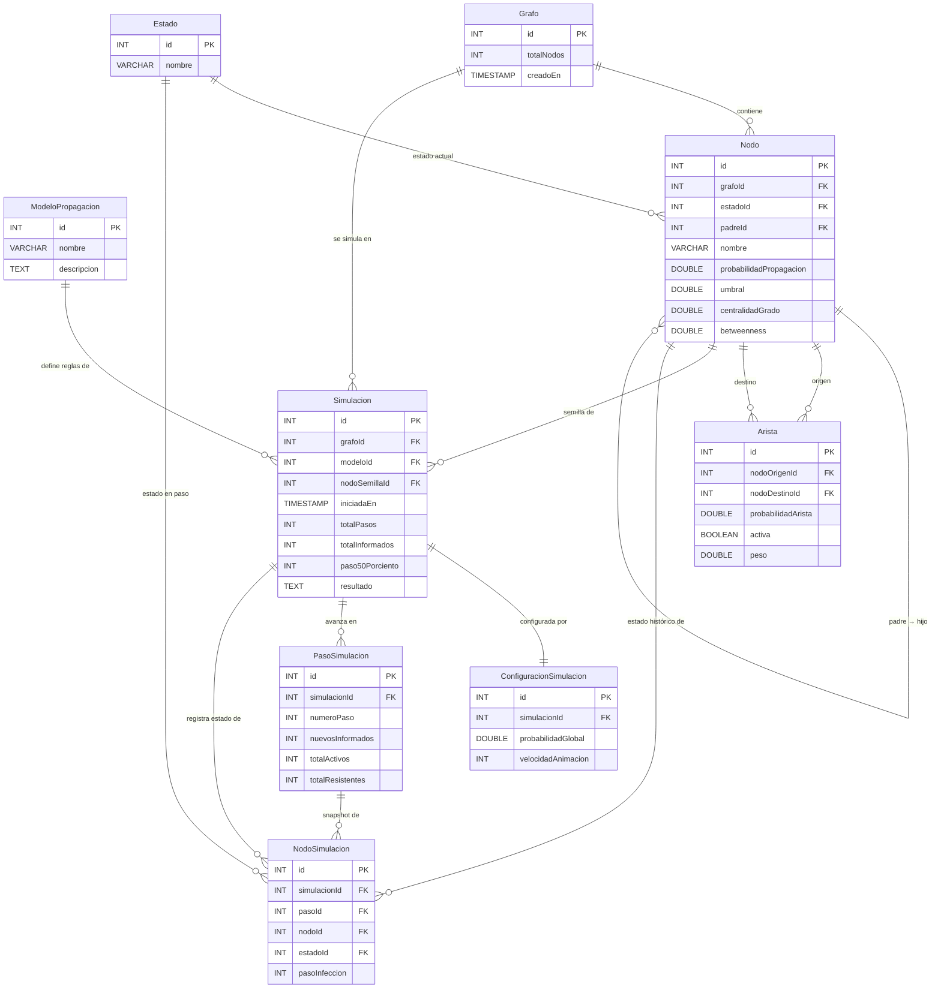

```mermaid
erDiagram
    Estado {
        INT id PK
        VARCHAR nombre
    }

    ModeloPropagacion {
        INT id PK
        VARCHAR nombre
        TEXT descripcion
    }

    Grafo {
        INT id PK
        INT totalNodos
        TIMESTAMP creadoEn
    }

    Nodo {
        INT id PK
        INT grafoId FK
        INT estadoId FK
        INT padreId FK
        VARCHAR nombre
        DOUBLE probabilidadPropagacion
        DOUBLE umbral
        DOUBLE centralidadGrado
        DOUBLE betweenness
    }

    Arista {
        INT id PK
        INT nodoOrigenId FK
        INT nodoDestinoId FK
        DOUBLE probabilidadArista
        BOOLEAN activa
        DOUBLE peso
    }

    Simulacion {
        INT id PK
        INT grafoId FK
        INT modeloId FK
        INT nodoSemillaId FK
        TIMESTAMP iniciadaEn
        INT totalPasos
        INT totalInformados
        INT paso50Porciento
        TEXT resultado
    }

    ConfiguracionSimulacion {
        INT id PK
        INT simulacionId FK
        DOUBLE probabilidadGlobal
        INT velocidadAnimacion
    }

    PasoSimulacion {
        INT id PK
        INT simulacionId FK
        INT numeroPaso
        INT nuevosInformados
        INT totalActivos
        INT totalResistentes
    }

    NodoSimulacion {
        INT id PK
        INT simulacionId FK
        INT pasoId FK
        INT nodoId FK
        INT estadoId FK
        INT pasoInfeccion
    }

    Grafo          ||--o{ Nodo               : "contiene"
    Nodo           ||--o{ Nodo               : "padre → hijo"
    Estado         ||--o{ Nodo               : "estado actual"
    Nodo           ||--o{ Arista             : "origen"
    Nodo           ||--o{ Arista             : "destino"
    Grafo          ||--o{ Simulacion         : "se simula en"
    ModeloPropagacion ||--o{ Simulacion      : "define reglas de"
    Nodo           ||--o{ Simulacion         : "semilla de"
    Simulacion     ||--|| ConfiguracionSimulacion : "configurada por"
    Simulacion     ||--o{ PasoSimulacion     : "avanza en"
    Simulacion     ||--o{ NodoSimulacion     : "registra estado de"
    PasoSimulacion ||--o{ NodoSimulacion     : "snapshot de"
    Nodo           ||--o{ NodoSimulacion     : "estado histórico de"
    Estado         ||--o{ NodoSimulacion     : "estado en paso"
```